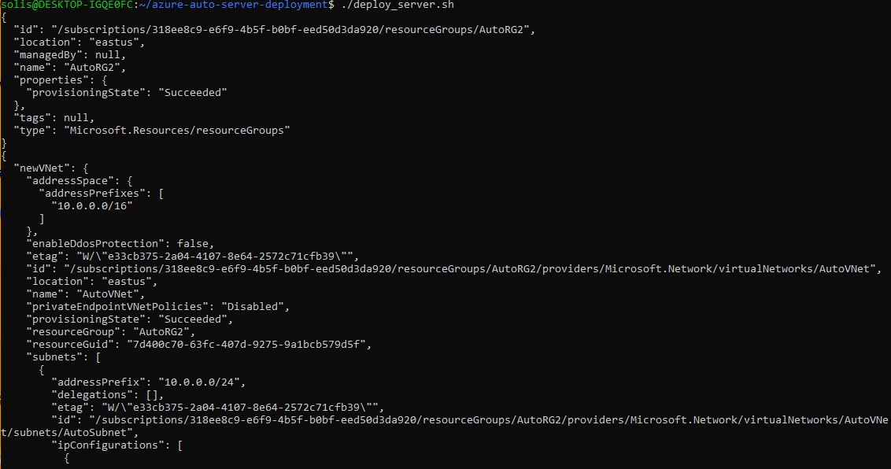
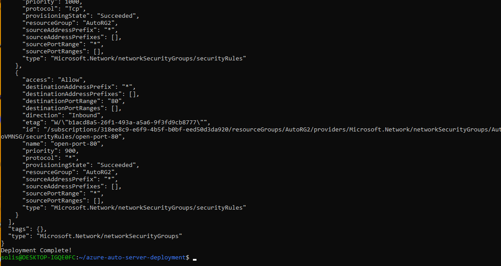
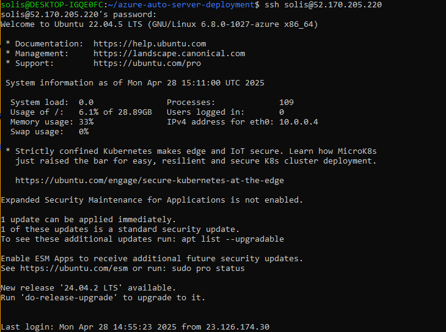
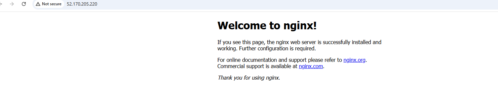

# Azure Auto Server Deployment

## How to Use

1. Login to Azure CLI:
```
az login
```

2. Make the script executable:
```
chmod +x deploy_server.sh
```

3. Run the script:
```
./deploy_server.sh
```

## Screenshots

| Step | Screenshot |
|:----|:------------|
| Deploy Script Run |  |
| Deploy Script Run Continued |  |
| SSH Login to VM |  |
| Website Hosted with Nginx |  |

## Future Improvements

- Add automated server hardening (UFW rules, Fail2Ban)
- Configure HTTPS with Let's Encrypt
- Expand to multi-VM scalable deployments

## Author

- Anthony Solis
- [GitHub Profile](https://github.com/ASolis2)

